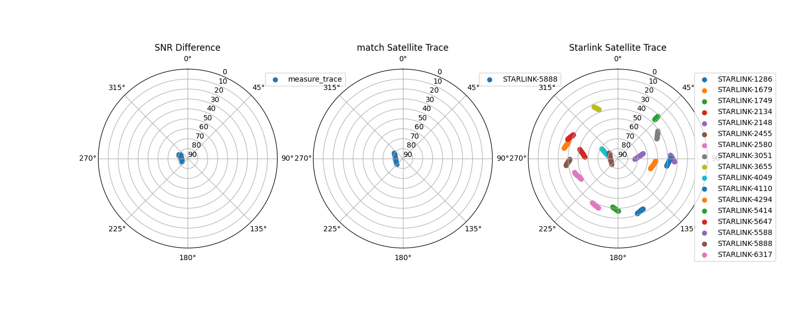

# Starlink Satellite Tracer

The Starlink Satellite Tracer is a Python project that allows you to track the Starlink satellite that is currently communicating with your dish. By utilizing the starlink-grpc library, this project enables you to monitor and trace the satellite that is within the line of sight of your dish in real time.

You can view an example visualization of the satellite trace:



This project is inspired by the paper "Making Sense of Constellations Methodologies for Understanding Starlink’s Scheduling Algorithms."

## Features

- Real-time tracking: The application fetches and displays the Starlink satellite currently communicating with your dish.
- Interactive visualization: The project provides a user-friendly interface to visualize the tracked satellite's position and movement.
- Satellite details: Additional information about the tracked satellite, such as satellite ID, real-time trace, is displayed.

## Installation

1. Clone the repository:

   ```
   git clone https://github.com/wdlctc/starlink-trace-tracker.git
   ```

2. Navigate to the project directory:

   ```
   cd starlink-trace-tracker
   ```

3. Install the project dependencies:

   ```
   pip install -r requirements.txt
   ```

4. Start the application:

   ```
   python main.py
   ```

5. The application will reboot your starlink dish for 3 mins and start fetching and displaying the real-time positions of Starlink satellites every 15s. totally lasting for 15 mins

## Usage

- Upon launching the application, the map will display the real-time positions of Starlink satellites every 15s.
- Print logged traces of the satellite's communication will be plotted for visualization and analysis.
- The application will also match the measured traces of minimum distance with all available satellite traces. And the resulting figures will be saved in the "figures" directory.

## Contributing

Contributions to the Starlink Trace Tracker project are welcome. If you would like to contribute, please follow these steps:

1. Fork the repository.
2. Create a new branch for your feature or bug fix.
3. Make the necessary changes and commit your code.
4. Push the changes to your fork.
5. Submit a pull request, explaining the changes you made.

## License

This project is licensed under the [MIT License](LICENSE).

## Acknowledgments

- This project is based on the starlink-grpc library ([GitHub repository](https://github.com/sparky8512/starlink-grpc-tools)), which provides access to the Starlink API.
- The project was inspired by the paper "Making Sense of Constellations Methodologies for Understanding Starlink’s Scheduling Algorithms".